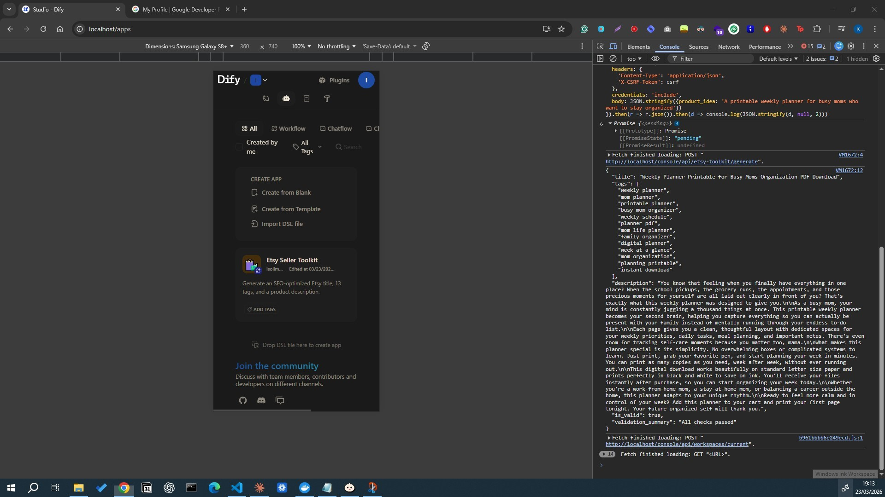

# Etsy Seller Toolkit

> A feature extension built on top of [Dify](https://github.com/langgenius/dify) (90k ⭐) that generates
> SEO-optimized Etsy listings from a single product idea — title, 13 tags, and a description,
> all validated against Etsy's constraints automatically.



## Live Demo

[Demo](https://www.loom.com/share/ba339dd2478e49b284e0edd20ba32fd8) 

Type a product idea → get a complete, validated Etsy listing in seconds.

**Input:**
```
A printable weekly planner for busy moms who want to stay organized
```

**Output:**
```json
{
  "title": "Weekly Planner Printable for Busy Moms Organization PDF Download",
  "tags": ["weekly planner", "mom planner", "printable planner", "busy mom organizer",
           "weekly schedule", "mom organization", "planner download", "family planner",
           "week at a glance", "mom life planner", "digital planner", "planning printable",
           "instant download"],
  "is_valid": true,
  "validation_summary": "All checks passed"
}
```

## Why I built this

I run an Etsy digital product store and know the SEO rules cold:
- Titles must be **3–14 words**
- Tags must be **≤20 characters each**, exactly **13 tags**
- Descriptions need to open with the buyer's desire, not keywords

Most AI tools ignore these constraints entirely. This one enforces them automatically and tells you exactly what's wrong if something fails validation.

## Architecture

```
Browser (etsy-toolkit.html)
    ↓  POST /console/api/etsy-toolkit/generate
nginx (Docker)
    ↓
Flask API route  (etsy_toolkit.py)
    ↓  calls Dify workflow internally
Dify Workflow Engine
    ↓  Start → LLM → Code → End
Claude (claude-haiku-4-5)
    ↓  JSON: title + tags + description
Python validation node
    ↓  checks word count, tag lengths, special chars
Validated JSON response
```

## What I added to Dify

This project extends Dify with three original additions:

**1. Workflow DSL** (`dify-workflows/etsy-seller-toolkit.yml`)
A 4-node workflow: Start → LLM (Claude with Etsy SEO prompt) → Code (Python validation) → End.
Import it into any Dify instance with one click.

**2. Python API Route** (`dify/api/controllers/console/etsy_toolkit.py`)
A Flask-RESTx endpoint that accepts a product idea, calls the Dify workflow, and returns
structured JSON. Mounted into Docker via `docker-compose.override.yml` without modifying
the upstream image.

**3. Frontend Demo** (`etsy-toolkit-demo.html`)
A zero-dependency HTML page served via nginx with full output rendering, per-field copy
buttons, and real-time Etsy constraint display.

## Tech Stack

| Layer | Technology |
|---|---|
| Platform | [Dify](https://github.com/langgenius/dify) v1.13.2 |
| LLM | Anthropic Claude via Dify plugin |
| Backend | Python 3.12 + Flask (Dify API service) |
| Frontend | Vanilla HTML/CSS/JS (zero build step) |
| Infrastructure | Docker Compose (11 services) |
| Workflow | Dify DSL with LLM + Code nodes |

## Setup

### Prerequisites
- Docker Desktop
- An Anthropic API key

### Run locally

```bash
git clone https://github.com/okalangkenneth/dify-etsy-toolkit
cd dify-etsy-toolkit/dify/docker
cp .env.example .env
# Add ETSY_TOOLKIT_WORKFLOW_KEY=your_key to .env
docker compose up -d
```

Open `http://localhost` and complete the Dify setup wizard, then:

1. **Plugins** → Install Anthropic → add your API key
2. **Studio** → Import DSL file → select `dify-workflows/etsy-seller-toolkit.yml`
3. Publish the workflow → copy its API key to `.env` as `ETSY_TOOLKIT_WORKFLOW_KEY`
4. Open `http://localhost/etsy-toolkit.html`

## Project structure

```
dify-etsy-toolkit/
├── etsy-toolkit-demo.html             # Standalone demo UI
├── dify-workflows/
│   └── etsy-seller-toolkit.yml        # Dify workflow DSL
└── dify/
    ├── docker/
    │   └── docker-compose.override.yml
    ├── api/controllers/console/
    │   └── etsy_toolkit.py            # Flask API route
    └── web/app/(commonLayout)/etsy-toolkit/
        └── components/                # Next.js components
```

## License

Built on [Dify](https://github.com/langgenius/dify) (Apache 2.0).
Our additions follow the same license.
